<p align="center">
  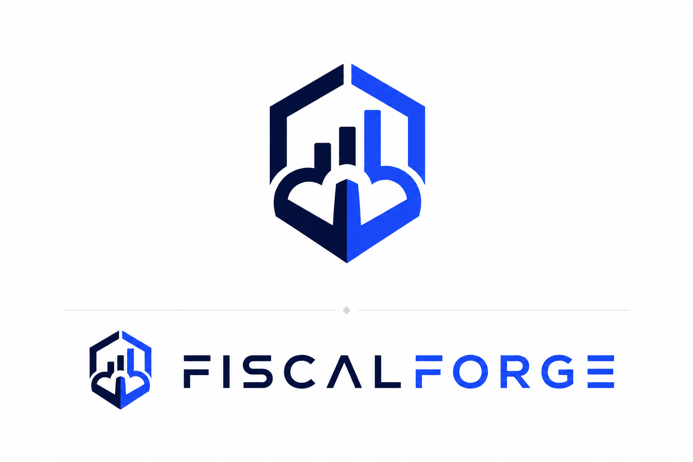
</p>

<h1 align="center">FiscalForge</h1>
<h3 align="center">Serverless AWS FinOps Platform with Agentic AI</h3>

<p align="center">
  <em>Understand your AWS spend. Find savings. Act with confidence.</em>
</p>

<p align="center">
  FiscalForge turns AWS cost and resource data into explainable optimization opportunities,<br/>
  then provides an AI advisor for understanding what is happening before taking action.
</p>

<p align="center">
  
  
  
  
  
  
  
  
  
</p>

---

<p align="center">
  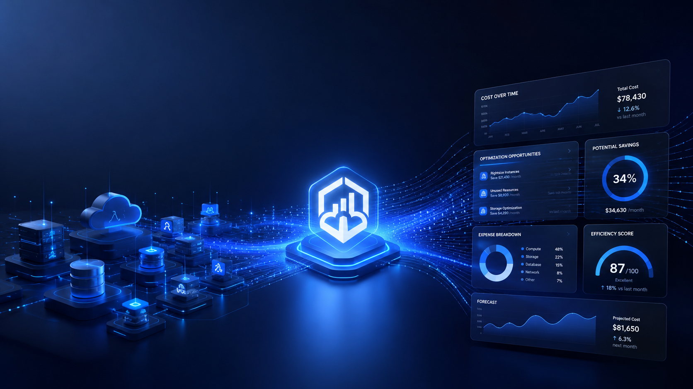
</p>

<p align="center"><strong>From raw AWS infrastructure signals to financial intelligence.</strong></p>

---

## Contents

[Why FiscalForge](#why-fiscalforge) · [Product](#the-product) · [Cost Intelligence](#01--cost-intelligence) · [Optimization Engine](#02--deterministic-optimization) · [Agentic AI](#03--agentic-ai-advisor) · [Security](#04--ai-can-recommend-humans-approve) · [Infrastructure](#infrastructure-visibility) · [Architecture](#architecture) · [Tech Stack](#tech-stack) · [Repository](#repository-structure) · [Quick Start](#quick-start) · [Testing](#testing) · [Deployment](#aws-deployment) · [Engineering Decisions](#engineering-decisions) · [Interview Story](#explain-fiscalforge-in-30-seconds) · [Roadmap](#roadmap)

---

## Why FiscalForge?

AWS environments make it easy to accumulate complexity without visibility — spending spread across dozens of services, underutilized resources that were never cleaned up, and cost signals that are technically available but practically impossible to interpret.

FiscalForge answers exactly four questions:

```
01  How much am I spending?
02  Where is the money going?
03  Which resources might be wasting money?
04  What should I do about it?
```

Everything in the system is built to answer these four questions and nothing else.

---

## From AWS Data to Financial Intelligence

<p align="center">
  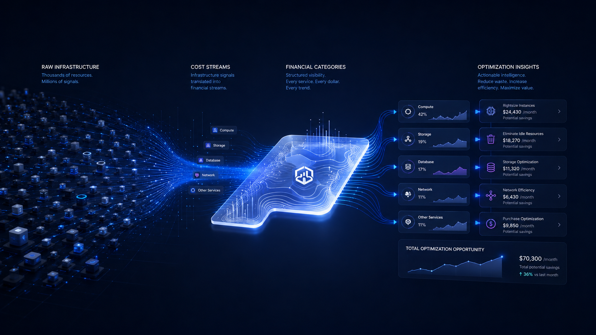
</p>

AWS infrastructure generates enormous operational data. FiscalForge turns that data into a small set of useful decisions.

```
AWS SIGNALS
     ↓
COST INTELLIGENCE      ← What did I spend? (Cost Explorer)
     ↓
RESOURCE VISIBILITY    ← What is running? (EC2 / RDS / S3)
     ↓
OPTIMIZATION SIGNALS   ← What is wasting money? (Deterministic rules)
     ↓
AI EXPLANATION         ← Why is this happening? (LangGraph agent)
     ↓
HUMAN DECISION         ← What do I do? (User-approved action)
```

---

## The Product

<table>
<tr>
<td>

| Route | Purpose |
|---|---|
| `/` | Product landing page |
| `/dashboard` | AWS spend overview and KPIs |
| `/costs` | Detailed cost analytics |
| `/resources` | EC2, RDS, and S3 inventory |
| `/advisor` | AI cost advisor |

</td>
</tr>
</table>

<p align="center">
  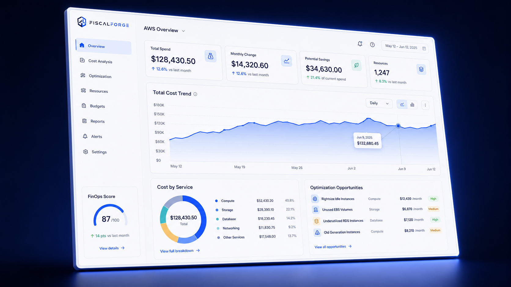
</p>

<p align="center"><strong>A unified view of AWS spending, resources, and optimization opportunities.</strong></p>

---

## 01 — Cost Intelligence

<p align="center">
  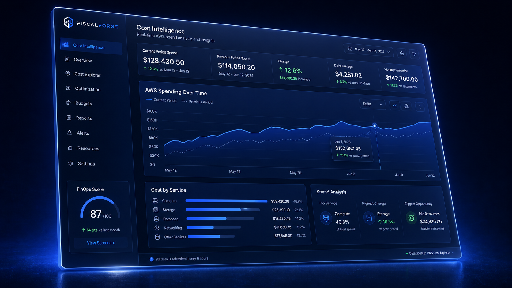
</p>

FiscalForge surfaces:

- Total AWS spend for the current period
- Daily spending trends (7-day and 30-day views)
- Per-service cost breakdown
- Period-over-period comparison with percentage change

```
AWS Cost Explorer
       ↓
Lambda (GetCostAndUsage)
       ↓
Normalization → CostSummary model
       ↓
GET /api/costs → Next.js
       ↓
Area chart · Service breakdown · KPI cards
```

**AWS source:** `ce:GetCostAndUsage`

---

## 02 — Deterministic Optimization

<p align="center">
  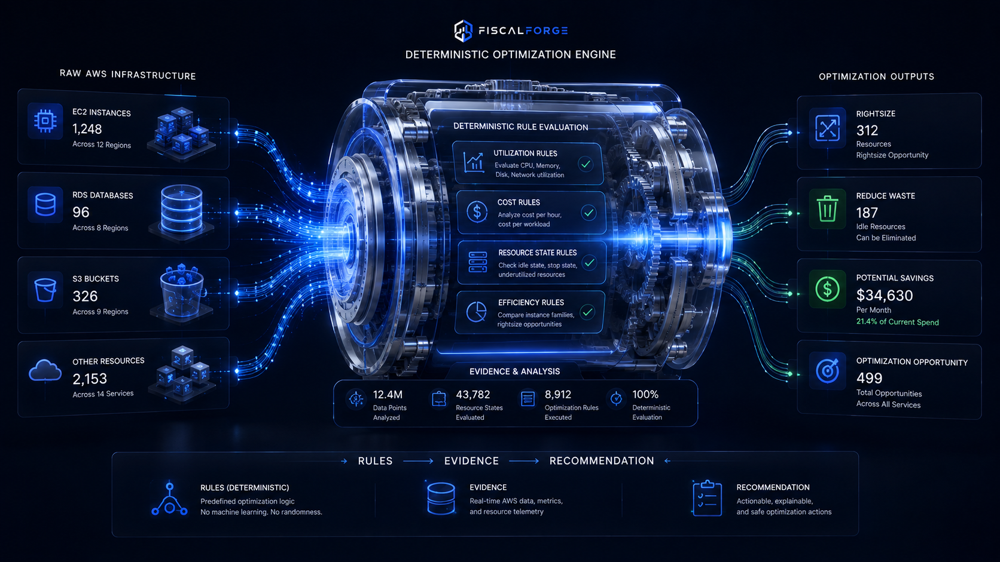
</p>

> **The AI does not invent optimization findings. Deterministic rules do.**

Cost optimization discovery is rule-based. The AI explains findings — it does not produce them.

```
AWS Metrics (CloudWatch CPU)
          ↓
Deterministic Rules Engine
          ↓
Structured Recommendation { severity, reason, savings }
          ↓
Sorted by severity → UI + AI tools
```

| Rule | Condition | Severity |
|---|---|---|
| EC2 Underutilization | Average CPU < 10% over 14 days | High |
| EC2 Rightsizing | Running > 30 days AND CPU < 10% | Medium |
| NAT Gateway | Minimal traffic detected | Medium |
| S3 Storage | Large bucket with infrequent access | Low |

> **Deterministic rules make recommendations explainable, testable, and reproducible. Same input always produces the same output.**

The 14-day evaluation window (vs. 7) reduces false positives from short-term CPU spikes. The 30-day rightsizing threshold prevents recommending downsizes before a workload establishes its baseline.

---

## 03 — Agentic AI Advisor

<p align="center">
  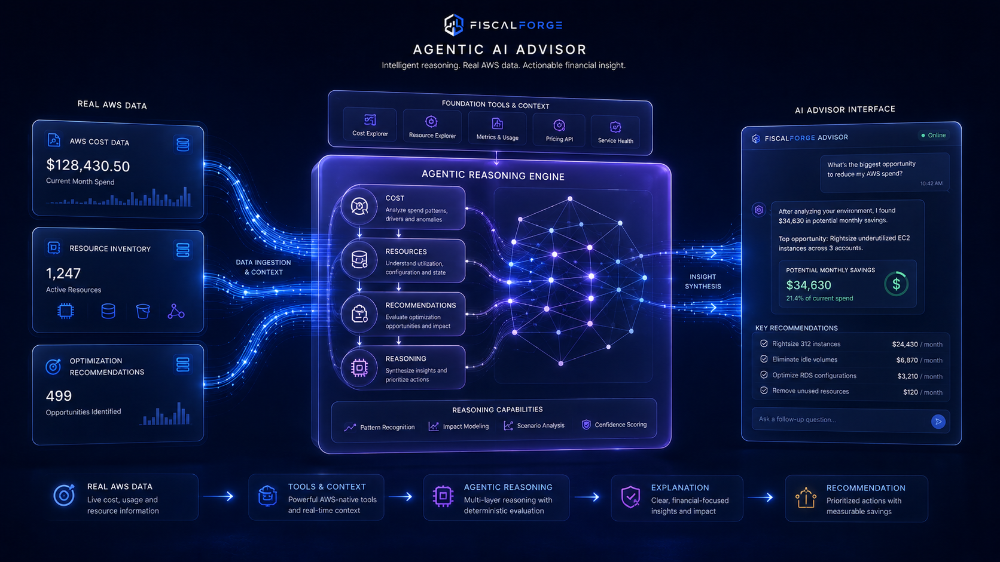
</p>

FiscalForge uses exactly one LangGraph ReAct agent. It has three read-only tools:

```python
get_cost_summary()       # Current and previous period AWS spend
get_resources()          # EC2 / RDS / S3 inventory with utilization
get_recommendations()    # Deterministic optimization findings
```

The agent selects which tools to call, retrieves the AWS-derived data, and reasons over real values before responding.

```
User Question
      ↓
LangGraph ReAct Agent
      ↓
Tool selection → one or more read-only tools
      ↓
AWS-derived structured data
      ↓
LLM reasoning over real values
      ↓
Grounded natural-language response
```

### Example Interaction

> **User:** Why did my AWS cost increase this month?

> **FiscalForge Advisor:** Your AWS spend increased by 12.4% compared to last month, reaching $4,281.62. The increase is driven primarily by EC2 ($1,820.10, +18%) and RDS ($920.20, +9%). I also found 3 optimization opportunities — two EC2 instances running at under 10% average CPU could be rightsized or stopped, saving an estimated $172.40/month. Would you like me to walk through the specific instances?

The advisor distinguishes between measured values (from AWS APIs), calculated values (derived from data), and estimates (approximations with stated basis).

---

## 04 — AI Can Recommend. Humans Approve.

<p align="center">
  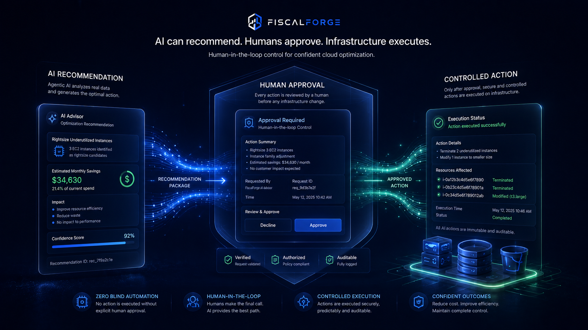
</p>

This is a core architectural invariant. The AI agent **cannot directly execute AWS actions**.

```
AI Advisor
    ↓
Recommendation (text only — AI output stops here)
    ↓
User Approval Dialog (explicit UI confirmation)
    ↓
POST /api/actions/ec2/stop
    ↓
Lambda → boto3
    ↓
AWS EC2 StopInstances
```

**Security properties:**

- No AWS credentials in frontend code or browser storage
- The browser never communicates directly with AWS APIs
- Lambda authenticates via IAM role — no hardcoded credentials anywhere
- `ec2:TerminateInstances` is **not granted** — only `StopInstances`
- All destructive actions require explicit user confirmation
- The AI agent has no access to the action endpoint

**MVP controlled action:** `POST /api/actions/ec2/stop`

---

## Infrastructure Visibility

<p align="center">
  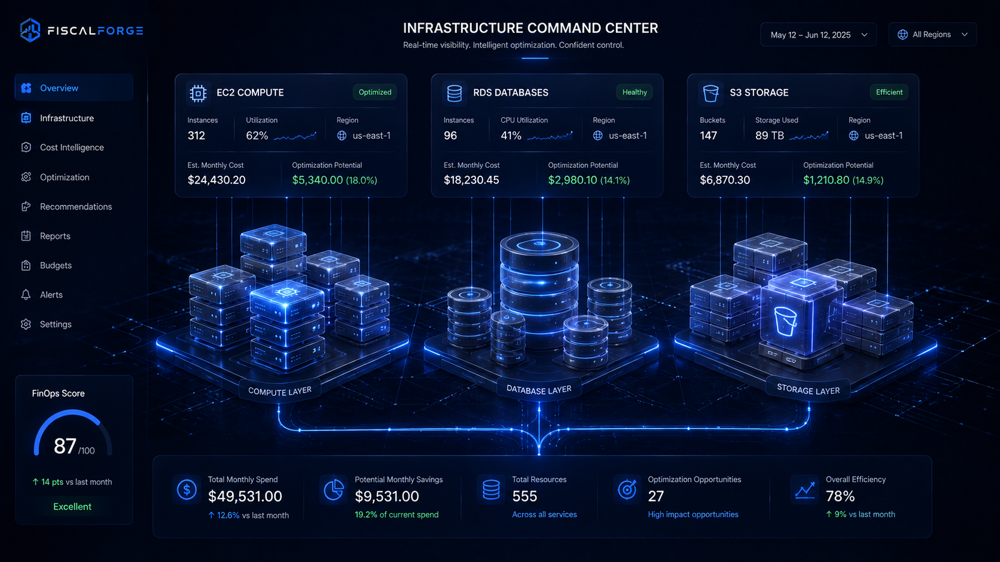
</p>

| Resource | Fields surfaced |
|---|---|
| **EC2** | instance ID, type, state, region, launch time, estimated cost, CPU utilization |
| **RDS** | identifier, engine, instance class, status, region, estimated cost |
| **S3** | bucket name, region, size (GB), object count, estimated cost |

Cost estimates use On-Demand pricing in us-east-1: lookup tables for EC2 and RDS, `$0.023/GB/month` for S3.

---

## From Infrastructure to Action

<p align="center">
  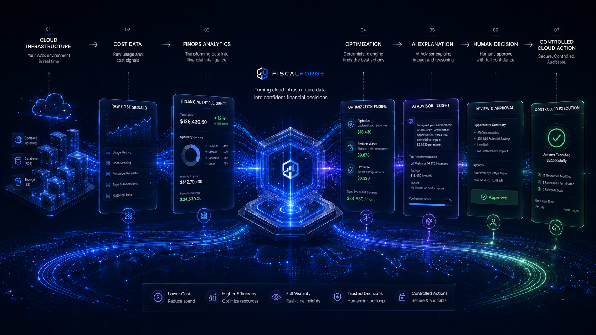
</p>

```
OBSERVE     AWS Cost + Resource data via boto3
    ↓
UNDERSTAND  Cost Intelligence — trends, breakdowns, comparisons
    ↓
DETECT      Deterministic Optimization Engine — rule-based findings
    ↓
EXPLAIN     Agentic AI Advisor — grounded natural-language reasoning
    ↓
DECIDE      Human review of AI recommendation
    ↓
ACT         Controlled AWS action through approved API endpoint
```

> FiscalForge deliberately separates observation, optimization, explanation, and execution.

---

## Architecture

<p align="center">
  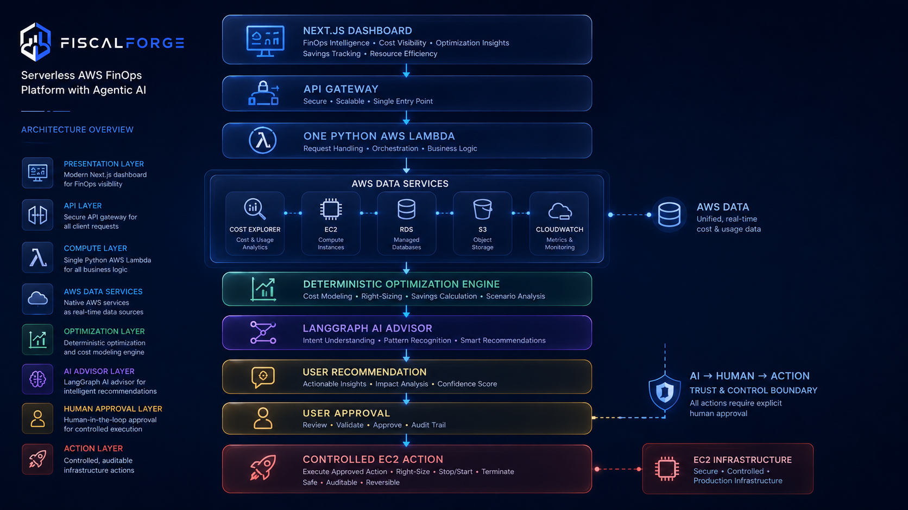
</p>

> FiscalForge intentionally uses a small, serverless architecture: one frontend, one API boundary, one Lambda backend, AWS APIs, one optimization engine, and one AI agent.

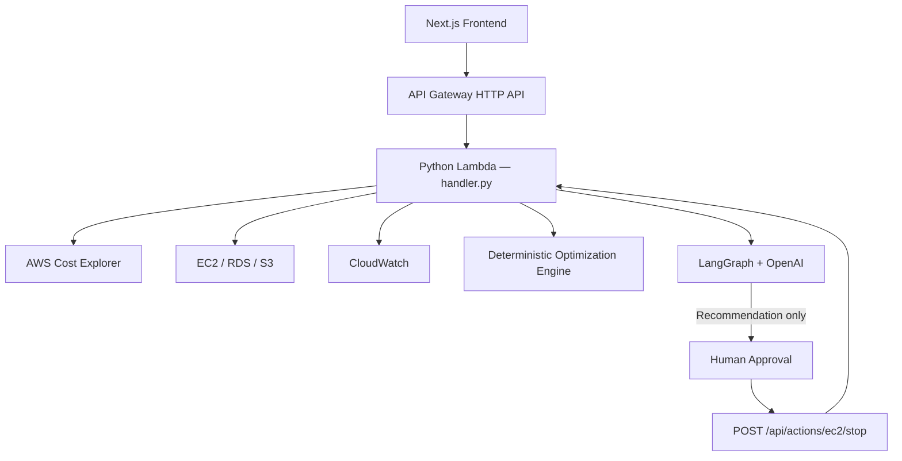

### The Principle

> **Keep the architecture boring. Make the product polished.**

```
1 Frontend
    ↓
1 API Gateway
    ↓
1 Lambda
    ↓
AWS APIs
    ↓
1 Optimization Engine
    ↓
1 AI Agent
    ↓
Human Approval
    ↓
Controlled AWS Action
```

This architecture is easy to deploy, easy to test, easy to reason about, and easy to explain.

### How a Request Works

**Cost data:**
```
01  User opens /dashboard
02  Next.js calls getCosts() via lib/api.ts
03  GET /api/costs → API Gateway → Lambda
04  Lambda calls Cost Explorer GetCostAndUsage
05  Response normalized to CostSummary model
06  JSON returned to frontend
07  Dashboard renders KPIs and area chart
```

**Optimization:**
```
01  Lambda fetches resource inventory + CloudWatch CPU metrics
02  Optimization engine evaluates each rule against each resource
03  Recommendations sorted by severity (high → medium → low)
04  RecommendationSummary returned → dashboard + resources pages
```

**AI advisor:**
```
01  User sends question via /advisor
02  POST /api/advisor → Lambda → LangGraph agent
03  Agent selects tools: get_cost_summary / get_resources / get_recommendations
04  Tools return AWS-derived data
05  LLM reasons over real values
06  Grounded response returned to chat UI
```

---

## Tech Stack

| Layer | Technology |
|---|---|
| Frontend | Next.js 15, TypeScript 5, React 19 |
| UI | Tailwind CSS 3, shadcn/ui, Lucide |
| Charts | Recharts 2 |
| Backend | Python 3.11 |
| API | AWS API Gateway (HTTP API) |
| Compute | AWS Lambda (single function) |
| AWS SDK | boto3 |
| Cost data | AWS Cost Explorer |
| Resource data | EC2, RDS, S3 |
| Metrics | CloudWatch |
| AI | LangGraph + OpenAI GPT-4o |
| Infrastructure | Terraform 1.6+ |
| CI/CD | GitHub Actions |
| Testing | pytest, moto |
| Quality | Ruff, mypy |

---

## Repository Structure

```
fiscalforge/
├── frontend/
│   ├── app/                    Five route pages
│   │   ├── page.tsx            /  — Homepage
│   │   ├── dashboard/          /dashboard
│   │   ├── costs/              /costs
│   │   ├── resources/          /resources
│   │   └── advisor/            /advisor
│   ├── components/             Reusable UI components
│   ├── lib/
│   │   └── api.ts              Centralized API client (only file calling fetch)
│   └── types/                  TypeScript interfaces matching API contract
│
├── backend/
│   ├── handler.py              Lambda entry point — routes all five endpoints
│   ├── config.py               Environment and mock-mode configuration
│   ├── models.py               Pydantic data models
│   ├── errors.py               Consistent error handling
│   ├── aws/                    boto3 adapters (cost_explorer, ec2, rds, s3, cloudwatch)
│   ├── optimization/           Deterministic rules engine
│   ├── agent/                  LangGraph agent, tools, system prompt
│   └── mock/                   Realistic mock data for local dev and CI
│
├── terraform/
│   ├── main.tf                 Lambda, API Gateway, CloudWatch log group
│   ├── iam.tf                  IAM role with least-privilege policy
│   ├── variables.tf
│   └── outputs.tf
│
├── tests/
│   └── backend/                pytest unit tests (no live AWS calls)
│       ├── test_costs.py
│       ├── test_resources.py
│       ├── test_optimization.py
│       └── test_actions.py
│
├── scripts/
│   └── build_lambda.sh         Builds fiscalforge-backend.zip for deployment
│
├── docs/
│   ├── architecture.md
│   └── api-contract.md
│
├── media/                      Visual assets (12 files)
├── .github/workflows/ci.yml    GitHub Actions CI pipeline
├── CLAUDE.md                   Engineering contract
├── requirements.txt
├── pyproject.toml
└── .env.example
```

---

## API Surface

| Method | Endpoint | Purpose |
|---|---|---|
| `GET` | `/api/costs` | Cost summary, daily trends, service breakdown |
| `GET` | `/api/resources` | EC2, RDS, S3 inventory with utilization |
| `GET` | `/api/recommendations` | Deterministic optimization findings |
| `POST` | `/api/advisor` | AI advisor — question → grounded response |
| `POST` | `/api/actions/ec2/stop` | Approved EC2 stop (human confirmation required) |

> The browser never communicates directly with AWS services.

```
Browser → API Gateway → Lambda → AWS
```

All API calls from the frontend go through `frontend/lib/api.ts`. Components never call `fetch()` directly.

---

## Quick Start

No AWS account required for local development.

**Prerequisites:** Node.js 20+, Python 3.11+

### 1. Clone and configure

```bash
git clone https://github.com/yourusername/fiscalforge.git
cd fiscalforge
cp .env.example .env
```

### 2. Start the backend (mock mode)

```bash
pip install -r requirements.txt
FISCALFORGE_MOCK_AWS=true python -m backend.dev_server
```

The mock backend runs at `http://localhost:8000`.

### 3. Start the frontend

```bash
cd frontend
npm install
npm run dev
```

The frontend runs at `http://localhost:3000` and proxies `/api/*` to the backend.

### Environment variables

```
FISCALFORGE_MOCK_AWS=true     # true for local dev; false for real AWS
AWS_REGION=us-east-1
OPENAI_API_KEY=               # Required only for the AI advisor
OPENAI_MODEL=gpt-4o
NEXT_PUBLIC_API_URL=http://localhost:8000
```

### Mock mode

> FiscalForge includes a mock AWS mode so the entire application can be developed and demonstrated without a live AWS environment.

When `FISCALFORGE_MOCK_AWS=true`, all boto3 calls are replaced with realistic mock data at the adapter layer. Business logic (optimization rules, handler routing, agent tools) is identical in both modes — the only difference is where the data comes from.

```
FISCALFORGE_MOCK_AWS=true
          ↓
AWS adapter checks config.mock_aws
          ↓
   True  → mock.cost_data / mock.resources / mock.metrics
   False → boto3 → real AWS APIs
```

---

## Testing

Backend tests make no live AWS calls. All optimization rules, cost calculations, resource normalization, and action validation logic are covered.

```bash
pytest tests/ -v
```

```bash
ruff check backend/ tests/
ruff format --check backend/ tests/
mypy backend/
```

Frontend validation:

```bash
cd frontend
npm run type-check
npm run lint
npm run build
```

Terraform validation:

```bash
cd terraform
terraform fmt -check
terraform init -backend=false
terraform validate
```

---

## CI/CD

GitHub Actions runs on every push and pull request.

```
Pull Request
     ↓
Backend     → ruff lint · ruff format · mypy · pytest
Frontend    → tsc --noEmit · next lint · next build
Terraform   → terraform fmt -check · terraform init · terraform validate
     ↓
Main branch → build Lambda zip (fiscalforge-backend.zip)
     ↓
Manual approval → terraform apply
```

The Lambda artifact is uploaded with 7-day retention. `terraform apply` is not automated — it requires manual execution.

---

## AWS Deployment

> `terraform apply` provisions real AWS infrastructure and incurs charges.

### Step 1: Build the Lambda package

```bash
./scripts/build_lambda.sh
```

Output: `dist/fiscalforge-backend.zip`

### Step 2: Deploy with Terraform

```bash
cd terraform
terraform init
terraform fmt
terraform validate
terraform plan
terraform apply
```

Terraform provisions: Lambda function, API Gateway HTTP API, IAM role with least-privilege policy, CloudWatch log group (14-day retention).

### Step 3: Set the OpenAI key

`OPENAI_API_KEY` is intentionally absent from Terraform state. Inject it post-deploy:

```bash
aws lambda update-function-configuration \
  --function-name fiscalforge-backend-dev \
  --environment "Variables={FISCALFORGE_MOCK_AWS=false,OPENAI_MODEL=gpt-4o,OPENAI_API_KEY=sk-...}"
```

If unset, the advisor returns a friendly unavailable message. The rest of the application continues normally.

### Step 4: Configure the frontend

```
NEXT_PUBLIC_API_URL=https://<id>.execute-api.us-east-1.amazonaws.com
```

### IAM permissions (least privilege)

| Service | Permissions | Reason |
|---|---|---|
| Cost Explorer | `GetCostAndUsage`, `GetCostForecast` | Read spending data |
| EC2 | `DescribeInstances`, `DescribeInstanceStatus`, `StopInstances` | Inventory + stop action |
| RDS | `DescribeDBInstances` | Inventory |
| S3 | `ListAllMyBuckets`, `GetBucketLocation`, `GetBucketAcl` | Bucket metadata |
| CloudWatch | `GetMetricStatistics`, `GetMetricData` | EC2 CPU utilization |
| CloudWatch Logs | `CreateLogGroup`, `CreateLogStream`, `PutLogEvents` | Lambda logging |

`ec2:TerminateInstances` is not granted.

---

## Engineering Decisions

| Decision | Why |
|---|---|
| Lambda | Request-driven workload with no need for a persistent server |
| API Gateway | Clean HTTP boundary; browser never touches AWS directly |
| Terraform | Infrastructure must be reproducible, not manually configured |
| Single Lambda | One function is easier to deploy, debug, and explain than microservices |
| Rule-based optimization | Recommendations must be deterministic, testable, and explainable |
| LangGraph | Structured tool orchestration for a ReAct loop over read-only data |
| Read-only AI tools | The agent advises — it does not execute |
| Human approval | A wrong model decision should not trigger a destructive cloud change |
| Mock AWS | Safe local development and CI without live AWS credentials |
| CloudWatch | Sufficient observability for the MVP without additional infrastructure |

### Deterministic Core. Probabilistic Interface.

```
Deterministic engine   →  finds the optimization opportunity
        ↓
AI agent               →  explains and contextualizes the opportunity
        ↓
Human                  →  makes the final decision
```

Optimization findings are always reproducible. The AI interface makes them understandable.

### What the AI can and cannot do

```
AI can:
  ✓  Analyze AWS spending patterns
  ✓  Explain cost changes with real data
  ✓  Answer FinOps questions in natural language
  ✓  Recommend actions

AI cannot:
  ✗  Directly stop EC2 instances
  ✗  Delete any resource
  ✗  Execute any destructive AWS action
  ✗  Access the /api/actions endpoint
```

---

## Gallery

<table>
<tr>
<td width="50%">

</td>
<td width="50%">

</td>
</tr>
<tr>
<td><em>Dashboard overview with KPIs and cost trends</em></td>
<td><em>Cost analytics with daily trends and service breakdown</em></td>
</tr>
</table>

<table>
<tr>
<td width="50%">

</td>
<td width="50%">

</td>
</tr>
<tr>
<td><em>Rule-based optimization findings with severity and estimated savings</em></td>
<td><em>AI advisor grounded in real AWS data</em></td>
</tr>
</table>

<table>
<tr>
<td width="50%">

</td>
<td width="50%">

</td>
</tr>
<tr>
<td><em>EC2, RDS, and S3 inventory with utilization data</em></td>
<td><em>Explicit confirmation before any AWS action executes</em></td>
</tr>
</table>

<p align="center">
  
</p>
<p align="center"><em>Complete system architecture</em></p>

<p align="center">
  
</p>
<p align="center"><em>From observation to controlled action</em></p>

---

## Explain FiscalForge in 30 Seconds

> A Next.js frontend sends requests through API Gateway to a single Python Lambda. The Lambda uses boto3 to retrieve AWS cost and resource data, a deterministic rules engine identifies potential savings, and a LangGraph agent explains those findings using three read-only tools. Terraform provisions the infrastructure. Human approval sits between AI recommendations and any AWS action.

### Common Questions

#### Why Lambda?
The workload is request-driven and doesn't require a continuously running server.

#### Why not microservices?
A single Lambda is easier to deploy, debug, and explain. The workload doesn't justify the operational overhead.

#### Why rule-based optimization instead of ML?
Cost recommendations must be deterministic, explainable, and independently testable. Rules give you the same finding every time for the same input.

#### Why does the AI not execute AWS actions?
A wrong model decision should not trigger a destructive cloud change without human review. The AI recommends; humans approve; Lambda executes.

#### Why Terraform?
Infrastructure must be reproducible. Manual configuration is not auditable and cannot be reviewed in a pull request.

---

## Resume Snapshot

```
FiscalForge — Serverless AWS FinOps Platform with Agentic AI
Next.js · Python · AWS Lambda · API Gateway · Terraform · boto3 · LangGraph · OpenAI · CloudWatch
```

- Designed and built a serverless FinOps platform answering cost, resource, optimization, and AI advisor questions through a five-endpoint Lambda backend
- Implemented a deterministic optimization engine producing reproducible, independently testable cost recommendations separate from AI reasoning
- Architected a LangGraph ReAct agent with read-only AWS data tools and a human-approval safety boundary preventing any direct AI-to-AWS action execution
- Provisioned least-privilege IAM, API Gateway, and CloudWatch observability with Terraform; validated via GitHub Actions CI on every pull request

---

## MVP Scope

### Included
- AWS cost intelligence (Cost Explorer, period comparison, daily trends)
- EC2 / RDS / S3 resource inventory with utilization
- Deterministic optimization engine (4 rules)
- LangGraph AI advisor (3 read-only tools)
- Human-approved EC2 stop action
- Terraform infrastructure (Lambda, API Gateway, IAM, CloudWatch)
- GitHub Actions CI
- Mock AWS mode for local development and CI

### Intentionally excluded
- Kubernetes, Kafka, Spark, Redis
- Microservices or multiple Lambda functions
- Multi-agent architecture
- Multi-account AWS Organizations
- Automatic destructive actions
- Custom ML forecasting

---

## Roadmap

- [x] AWS cost intelligence
- [x] EC2 / RDS / S3 inventory
- [x] Deterministic optimization engine
- [x] Agentic AI advisor
- [x] Human-approved EC2 stop action
- [x] Terraform infrastructure
- [x] GitHub Actions CI
- [x] Mock AWS mode
- [ ] Expanded optimization rules (Reserved Instance analysis, EBS volumes)
- [ ] Broader controlled AWS actions (start, resize)
- [ ] Multi-account support

---

<p align="center">
  <strong>FiscalForge</strong>
</p>

<p align="center">
  <em>Understand your AWS spend. Find savings. Act with confidence.</em>
</p>

<p align="center">
  Built as a focused demonstration of Software Engineering · AWS · DevOps · Agentic AI
</p>
